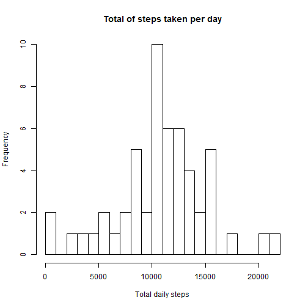
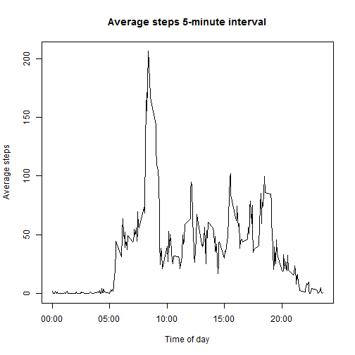
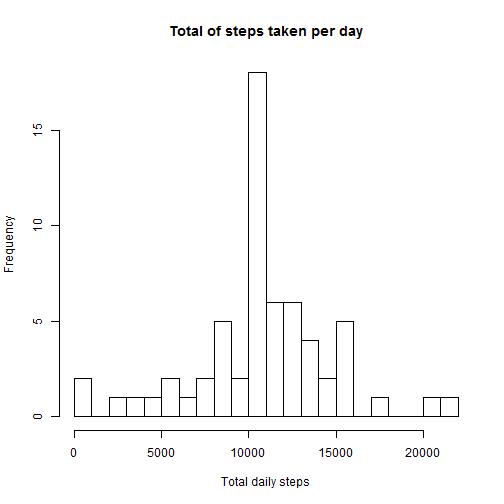
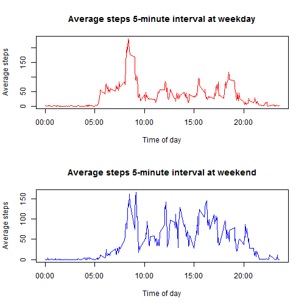
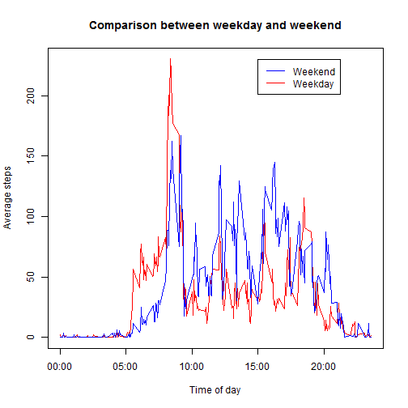

## Prepare the environment

```r
rm(list=ls())
library(knitr)
opts_chunk$set(echo = TRUE)
```

## Loading and preprocessing the data
__Prerequisite__:
* Identify the currect working directory by using getwd()
* Create a new directory using dir.create()
* Set current working directory to the newsly created directory above by using setwd()
* create a 'data' directory by using dir.create()
* Download the zip file(repdata_data_activity.zip) to the data directory
* Extract data file(activity.csv) into the 'data' directory in the current working directory.

__Read__ data from the downloaded _activity.csv_ file.
__Verfiy__ that attributes _steps_, _date_, and _interval_ are present in the data.

```r
data = read.csv('./data/activity.csv', header = T)
names(data)
```

```
## [1] "steps"    "date"     "interval"
```

```r
str(data)
```

```
## 'data.frame':	17568 obs. of  3 variables:
##  $ steps   : int  NA NA NA NA NA NA NA NA NA NA ...
##  $ date    : Factor w/ 61 levels "2012-10-01","2012-10-02",..: 1 1 1 1 1 1 1 1 1 1 ...
##  $ interval: int  0 5 10 15 20 25 30 35 40 45 ...
```

```r
head(data)
```

```
##   steps       date interval
## 1    NA 2012-10-01        0
## 2    NA 2012-10-01        5
## 3    NA 2012-10-01       10
## 4    NA 2012-10-01       15
## 5    NA 2012-10-01       20
## 6    NA 2012-10-01       25
```

## What is mean total number of steps taken per day?

```r
total_Dailysteps <- as.numeric(tapply(data$steps, data$date, sum))
mean_DailySteps <- mean(total_Dailysteps, na.rm = TRUE)
median_DailySteps <- median(total_Dailysteps, na.rm = TRUE)
```
_Mean_

```r
print(mean_DailySteps)
```

```
## [1] 10766.19
```
_Median_

```r
print(median_DailySteps)
```

```
## [1] 10765
```
_Histogram_

```r
hist(tapply(data$steps, data$date, sum), xlab = "Total daily steps", breaks = 20, main = "Total of steps taken per day")
```

 

## What is the average daily activity pattern?

```r
data$interval <- as.factor(as.character(data$interval))
intervalMean <- as.numeric(tapply(data$steps, data$interval, mean, na.rm = TRUE))
allIntervals <- data.frame(interval = as.numeric(levels(data$interval)), intervalMean)
allIntervals <- allIntervals[order(allIntervals$interval), ]
labels <- c("00:00", "05:00", "10:00", "15:00", "20:00")
labels.at <- seq(0, 2000, 500)
plot(allIntervals$interval, allIntervals$intervalMean, type = "l", main = "Average steps 5-minute interval", ylab = "Average steps", xlab = "Time of day", xaxt = "n")
axis(side = 1, at = labels.at, labels = labels)
```

 
_Which 5-minute interval, on average across all the days in the dataset, contains the maximum number of steps?_

```r
intervalsSortedWithMean <- allIntervals[order(allIntervals$intervalMean, decreasing = TRUE), ]
intervalsSortedWithMean$interval[1[1]]
```

```
## [1] 835
```

## Imputing missing values
_Calculate and report null values_

```r
sum(is.na(data$steps))
```

```
## [1] 2304
```
_Device a strategy and fill NA with mean value_

```r
fixValue <- function(x,y){
  if(is.na(x)){
    
    return(y)
  }
  return(x)
}
new_data <- merge(data,allIntervals,by="interval")
new_data$new_steps = mapply(fixValue,new_data$steps, new_data$intervalMean)
```

_Draw Histogram_

```r
hist(tapply(new_data$new_steps, new_data$date, sum), xlab = "Total daily steps", breaks = 20, main = "Total of steps taken per day")
```

 


```r
total_DailystepsNonNull <- as.numeric(tapply(new_data$new_steps, data$date, sum))
mean_DailyStepsNonNull <- mean(total_DailystepsNonNull, na.rm = TRUE)
median_DailyStepsNonNull <- median(total_DailystepsNonNull, na.rm = TRUE)
```
_Mean_

```r
print(mean_DailyStepsNonNull)
```

```
## [1] 10766.19
```
_Median_

```r
print(median_DailyStepsNonNull)
```

```
## [1] 9127.585
```

After **filling the missing values with the mean for that range**, the **mean** is similar to the _mean_ with _all values including null values_.

After **filling the missing values with the mean for that range**, the **median** decreasd from the _mean_ with _all values including null values_.

## Are there differences in activity patterns between weekdays and weekends?
* Add an attribute which states either its a weekday or weekend based on the 'date' attribute
* Factor the newly created attributed which essentially reduces to two levels viz. weekday and weekend
* Calculate the mean of both weekday and weekend. Store them in two separate factor variables
* Create a combined (weekday and weekend) data frame 

```r
new_data$dayType <- c("weekend", "weekday", "weekday", "weekday", "weekday", "weekday", "weekend")[as.POSIXlt(new_data$date)$wday + 1]
new_data$dayType <- as.factor(new_data$dayType)

new_dataWeekday <- new_data[new_data$dayType == "weekday", ]
new_dataWeekdayMeans <- as.numeric(tapply(new_dataWeekday$new_steps, new_dataWeekday$interval, mean))

new_dataWeekend <- new_data[new_data$dayType == "weekend", ]
new_dataWeekendMeans <- as.numeric(tapply(new_dataWeekend$new_steps, new_dataWeekend$interval, mean))

new_dataIntervalsDayType <- data.frame(intervals = as.numeric(levels(new_data$interval)), new_dataWeekdayMeans, new_dataWeekendMeans)

new_dataIntervalsDayType <- new_dataIntervalsDayType[order(new_dataIntervalsDayType$interval), ]
```
Create two graphs; for weekend and weekday

```r
par <- par(mfrow = c(2, 1))
plot(new_dataIntervalsDayType$interval, new_dataIntervalsDayType$new_dataWeekdayMeans, type = "l", 
    col = "red", ylab = "Average steps", xlab = "Time of day", main = "Average steps 5-minute interval at weekday", 
    xaxt = "n")
axis(side = 1, at = labels.at, labels = labels)
plot(new_dataIntervalsDayType$interval, new_dataIntervalsDayType$new_dataWeekendMeans, type = "l", 
    col = "blue", ylab = "Average steps", xlab = "Time of day", main = "Average steps 5-minute interval at weekend", 
    xaxt = "n")
axis(side = 1, at = labels.at, labels = labels)
```

 


Display both weekday and weekend in a single graph

```r
par <- par()
plot(new_dataIntervalsDayType$interval, new_dataIntervalsDayType$new_dataWeekdayMeans, type = "l", 
    col = "red", ylab = "Average steps", xlab = "Time of day", main = "Comparison between weekday and weekend", 
    xaxt = "n")
axis(side = 1, at = labels.at, labels = labels)
lines(new_dataIntervalsDayType$interval, new_dataIntervalsDayType$new_dataWeekendMeans, type = "l", col = "blue")
legend(1500, 230, c("Weekend", "Weekday "), lty = c(1, 1), lwd = c(1, 1), col = c("blue", "red"))
```

 
